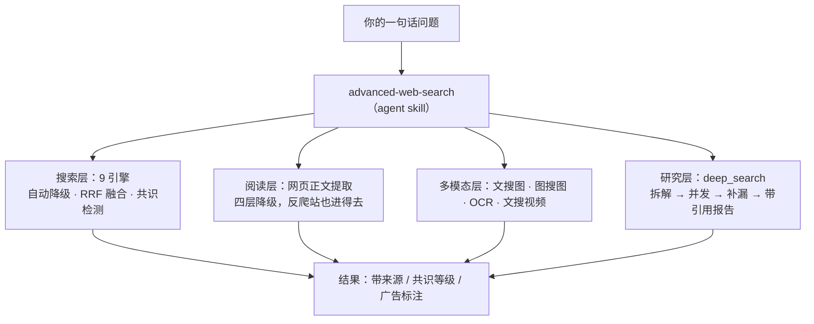
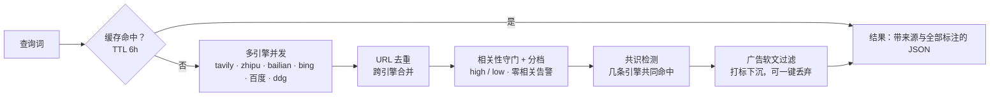

# advanced-web-search

**一个 agent skill（智能体技能包）**：通用联网搜索与研究执行器——一套 Python 脚本集合，把**多引擎网页搜索、网页正文提取、四种跨模态检索（文搜网/文搜图/图搜文/图搜图）与深度研究**装进同一个可离线部署的目录。免 key 即可用（HTML 引擎），付费引擎全部可选、按次计费、默认关闭或按需调用。

> 给 agent 读的完整用法在 [SKILL.md](SKILL.md)；本文写给人类使用者。

## 安装与定位（这是一个 skill）

**它是给 AI 助手用的 skill，不是给你直接点开的软件。** 工作方式是：你正常对 AI 说"帮我查查 XX"，AI 自己到这个目录里拿工具干活。

安装（放进支持 skill 的 AI 工具的技能目录，以 ZCode 为例）：

```bash
git clone https://github.com/Solara1020/advanced-web-search.git ~/.agents/skills/advanced-web-search
pip install requests beautifulsoup4 jieba   # 核心依赖，增强层见"快速开始"
```

装好后 AI 在新会话里自动发现它（入口是 [SKILL.md](SKILL.md)），无需注册或配置；不配任何密钥也能用免 key 引擎。



## 这是什么（小白版）

一句话：**这是给 AI 助手用的"联网调研工具箱"**。AI 要查资料时从这里拿工具——你不需要会用它，正常说"帮我查查 XX"就行，工具是 AI 自己挑的。

它解决普通搜索的三个老大难：

1. **一个搜索引擎靠不住** → 内置 9 个搜索引擎，各有特长。坏一个自动换下一个；还能"多问几家、答案对得上才算数"（`--cross-verify` 共识检测）。
2. **结果里全是广告和垃圾** → 推销软文自动识别并垫底（可一键扔掉）；某个引擎整页被垃圾站占据会报警提醒"这轮别信它"；查不到就明说"没找到"，**绝不编造**。
3. **只能搜文字** → 还能读网页全文（反爬网站也进得去）、看图识字（OCR）、以图搜图、找视频、查 B站数据；复杂问题会自动拆解、搜索、写成带引用编号的调研报告。

花钱方面：一半引擎免费随便用；付费引擎每次几分钱且默认不启用；同一个问题 6 小时内重复问，直接给缓存答案不重复扣费。

## 关于作者与一份诚实披露

- 这个工具箱的完整来路（从本地虚拟机上的旧工作流，到今天的开源）见 **[HISTORY.md](HISTORY.md)**——挺长的一段故事。
- **诚实披露**：本项目的文档（README、HISTORY.md 等）几乎全部由 AI 代笔；代码的绝大多数也由 AI 构建。作者负责定方向、做取舍、在实际使用中发现问题和提需求，AI 负责实现与记录。
- 作者只是一名高中生，课业之外有这么点爱好，凭兴趣折腾出了它。如果你觉得有用，欢迎拿去用、改、分享。

## 功能一览

| 能力 | 说明 | 零成本可用 |
|---|---|---|
| 文搜网 | 9 引擎自动降级 / `--fuse` RRF 多引擎融合 / `--cross-verify` 多引擎共识检测 / jieba 相关性分档 / 招生广告软文过滤 | ✅（bing/百度/ddg） |
| 百科词条 | Wikimedia 词条（智谱 MCP broker，0.01 元/次） | — |
| 网页正文提取 | bs4 启发式 → Playwright 渲染 → StealthyFetcher 反检测（过 Cloudflare）→ Jina，四层自动降级 | ✅ |
| 文搜图 | Bing + 百度图片（免 key）+ 智谱 MCP（按需） | ✅ |
| 图搜图 | 百度识图（本地文件）/ 智谱反向图搜·图出处·区域放大（公网 URL，0.01 元/次）/ 本地 dhash·phash | ✅ |
| 图搜文（OCR） | 视觉大模型 / easyocr / tesseract 三通道 | ✅（easyocr） |
| 文搜视频 | Bing 视频通道（真实视频 URL/上传人/上传时间） | ✅ |
| 平台站内数据 | B站 UP主/视频数据直连（免签名接口） | ✅ |
| 网页截图 | 全页/元素截图，批量 | ✅ |
| 深度研究 | Planner 拆解 → 并发搜索 → 缺口补搜 → 带引用报告 | — |
| 结果后处理 | `--rerank`（/v1/rerank 真端点）/ `--embed` 向量化（默认关闭） | — |
| 查询缓存 | sqlite，TTL 6h，省按次费 | ✅ |

## 一次搜索都发生了什么



## 快速开始

```bash
# 依赖（核心层）
pip install requests beautifulsoup4 jieba

# 搜索（免 key 引擎，零配置）
python scripts/search.py "查询词"
python scripts/search.py "查询词" --engine bing_html,baidu_html --fuse 2      # 多引擎融合
python scripts/search.py "查询词" --cross-verify 3 --engine bing_html,baidu_html,zhipu  # 共识检测

# 正文提取（含 Cloudflare 防护站）
python scripts/read_page.py "https://example.com/article"

# 更多通道（图搜图/OCR/视频/B站/深度研究）见 SKILL.md 通道表
```

付费引擎（tavily / 智谱 / 百炼 / DMXAPI）均为可选：不配 key 自动跳过，配置后按次计费。

## 配置与密钥

- **零配置可用**：没有 `config.json`（或留 `{}`）全部走内置默认。引擎池顺序、费用档、缓存 TTL、广告过滤词表等都在 `config.json` 可改，字段全可选。
- **密钥**：环境变量优先；其次 `secrets.json`（skill 根目录，明文，随目录整体迁移）。⚠️ `secrets.json` 与 `cache.db` 含隐私，**已列入 .gitignore，禁止提交仓库或分享**。
- **端点可换**：`zhipu.api_base` / `tavily.api_base` / `dashscope.mcp_base` / `dmxapi.base_url` 均已参数化，可指向代理或自建网关。

## 已知限制（如实版）

- DuckDuckGo 需梯子；Bing 个别查询整页被 SEO 农场占据（结果层有 `quality_notes` 占榜告警）。搜狗（网页版与识图）已移除：前者常态验证码、后者入口下线。
- 智谱引擎部分查询直接 0 条；开启 `--days` 时间过滤后服务端不返回 URL（结果带 `url_missing` 标记，标题/日期可用）。
- 智谱图搜图只接受**公网可达的图片 URL**（本地文件会被服务端拒绝），中文图源命中偏弱。
- Wikimedia 引擎是实体词条索引不是全文检索：适合已知词条名的定名核实，不适合开放式检索。
- 多引擎共识的现实预期：2 家共同命中（mid）是常见上限，3 家同 URL（high）较少——共识不等于正确，关键数据仍需回官方源核对。

## 文档地图

- `SKILL.md` — agent 用法入口：通道表、执行顺序、失败处理
- `references/engine-comparison.md` — 引擎多维对比与选型决策（实测数据）
- `HISTORY.md` — 从旧工作流到开源的完整历程
- `references/engines.md` — 引擎细节、实测边界与踩坑记录

## 版本与发布

- 版本号规则：`vX.Y.Z`（大功能 / 小升级 / 修复）。
- 每个版本对应一个 git tag，并在 [Releases](https://github.com/Solara1020/advanced-web-search/releases) 页有一份独立的更新说明——可以像翻书一样一个版本一个版本地看改了什么。
- 当前版本：**v3.2.1**。

## 借鉴与致谢

思想/架构借鉴（**未复制任何代码**，许可只约束表达不约束思想；唯一直接依赖是 Scrapling）：

- [Scrapling](https://github.com/D4Vinci/Scrapling)（BSD-3-Clause）—— 反抓取工程思路（TLS 指纹、StealthyFetcher 反检测浏览器），**同时是本 skill 的 pip 依赖**
- [GPT-Researcher](https://github.com/assafelovic/gpt-researcher)（Apache-2.0）/ [MindSearch](https://github.com/InternLM/MindSearch)（Apache-2.0）—— deep_search 的"Planner 拆解 → 并发执行 → 缺口补搜 → 引用报告"架构思想
- [Elasticsearch](https://www.elastic.co/) 的 RRF 融合公式 —— 多引擎排名融合算法（公式不受版权保护，实现为本项目独立编写）
- [Firecrawl](https://github.com/mendableai/firecrawl)（AGPL-3.0）/ [SearXNG](https://github.com/searxng/searxng)（AGPL-3.0）/ Jina Reader —— 调研阶段的对照参考，未使用其代码（AGPL 项目不复制代码是硬红线）

## License

[MIT](LICENSE) —— 2026-09-29 定案、2026-09-30 首发。可自由使用/修改/再分发（含商用），保留版权声明即可；借鉴来源见上方"借鉴与致谢"。
